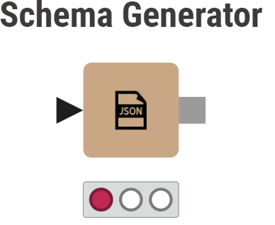
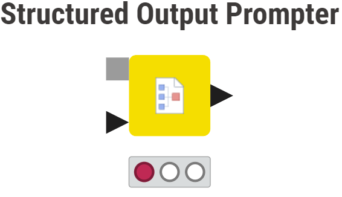
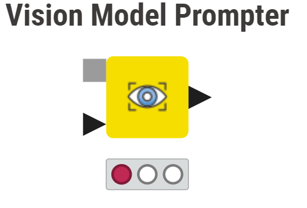
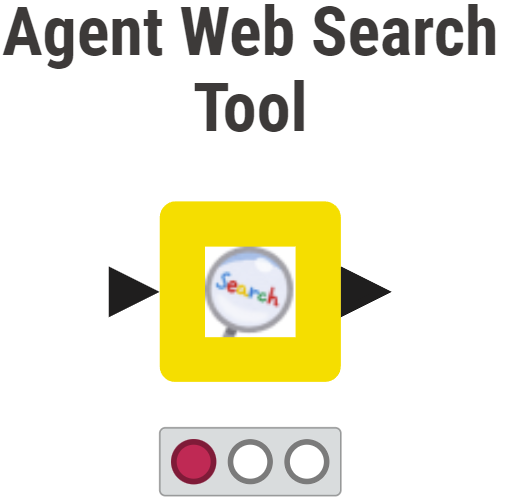
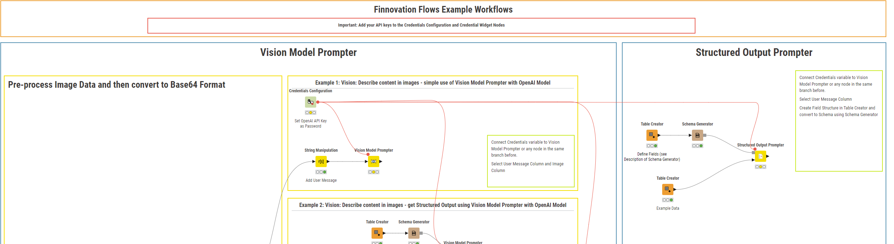

<h1>Finnovation Flows KNIME Extension</h1>

  

This is an Extension that provides advanced AI / LLM and in the future potential other functionality that is not yet available in the KNIME LLM / Gen AI extension.

## Table of Contents

1. [Included Nodes](#included-nodes)
2. [Installation](#installation)
3. [Example Workflows](#example-set-up-in-knime)

## Included Nodes:
 
 

  

 

### Description
The Schema Generator allows to turn an input table into a valid JSON Schema that can be passed to the Structured Output Prompter Node.
This ensures that the LLM sticks to the predefined Schema.

The node allows for the following configuration:
* Enable or disable strict mode via checkbox

the following columns need to be present in the input table:
* Fieldname(string): The name of the field in the schema.
* Datatype(string): The datatype of the field (note: Thus far only str = string is supported).
* Description(string): A description of the field.
* limitoptions(boolean): Indicates whether the field has limited options (true/false). If true, Options must be provided.
* Options(string): If the field has limited options, this column contains them separated by commas.
* isrequired(boolean): Indicates whether the field is required in the schema (true/false)

Every Row in the Input Table will be turned into one Field in the resulting JSON Schema. Please note: Thus far nesting is not supported.
Any Field will be on the first level of the resulting JSON Schema.

 
 

  

### Description
The Structured Output Prompter Node takes a prompt and a JSON Schema as input and generates structured output based on the provided schema. The generated output adheres to the specified schema, ensuring that it matches the expected structure and data types.

The node takes the following inputs:
* Valid JSON Schema that was created by the Schema Generator Node
* Input table that contains an arbitrary number of columns - one of the can be selected as the column that contains the user message to be provided to the LLM.

The node allows for the following configuration:
* model: manually input a valid OpenAI model - suggestion is gpt-4o or gpt-4o-mini. Exact list of available models can be found here: https://platform.openai.com/docs/models/gpt-4o-mini. Note: thus far there is no validation implemented.
* System Prompt: The system prompt to use for the OpenAI model. This System Prompt will be passed to the model for any User Message in the Input table
* User Message Column: Allows selection of the column from the input table that contains the user message.
* Credentials Parameter: Allows selection of a credentials parameter (flow variable) that was created via Credentials Widget or Credentials Configuration. The password provided in Credentials Widget or Configuration will be used as API Key

 
 

  

### Description

This Node allows you to prompt an OpenAI or Anthropic Chat Model with Vision Capability.
When selecting OpenAI and providing a different base URL under Advanced Settings, it is also possible
to prompt Vision Models that are hosted e.g. locally via Ollama, provided the Endpoint is compatible with OpenAI Chat Format.

The selected Image column must contain an image in .PNG format. Please refer to the examples in the documentation on GitHub to see an example set up.

For OpenAI models it is also possible to add a Structured Output Schema using the Schema Generator Node of this extension.
Note: For any model other than OpenAI, any provided Schema is ignored and the "raw response" is returned. This is also the case for the unlikely
scenario, that an OpenAI model does not fully stick to the Schema and responds differently.

This node requires the presence of an credential variable that can be created via Credentials Widget Node or Credentials Configuration Node.
The content of the "Password" field will be used as API Key. The presence of a credentials variable is also required, if a local model is prompted.

Required Inputs: Input Table containing the user message column
Optional Inputs: Valid JSON Schema generated by Schema Generator Node

 
 

  

### Description

This node performs a websearch using DuckduckGo Search engine and then scrapes the contents of returned URLs using 
trafilatura and goose3 python packages. Two scraping packages are used to provide some redundancy as in some cases goose3 may succeed whereas trafilatura does not and vice versa.

Whereas this node has been developed as a means to provide a way for AI Agents based on KNIME to effectively Search the Web, this node can be used in general for web search as well.

Required Inputs: Input Table containing a column with one or more search queries
Configuration: 
  - Query Column: Column containing search queries
  - Maximum Results (1-25): Maximum number of search results to be returned per search query
  - Safe Search: On / Moderate / Off

 
 

## Installation
### Video
Click to watch:

### Instructions and Screenshots

  

1. Download "build" Folder to local drive
2. Add local "build" Folder as Update Site: In KNIME, click Preferences (1), Install/Update (2), Available Software Sites (3), Add (4), Local (5) ==> browse to the downloaded folder and click Add (6).

3. Install Extension: In KNIME, click Menu (1), Install Extensions (2), Type "Finnovation" in Search box (3), Select "AI utilities" (4), Click next / finish until dialogue disappears

  

4. Wait for Installation to Finish - you will be prompted to restart KNIME
5. Search for nodes: Schema Generator and Structured Output Prompter in your node repository

## Example Set Up in KNIME:
Comprehensive Example Workflows on how to use these nodes can be found on KNIME Community Hub here:

  

